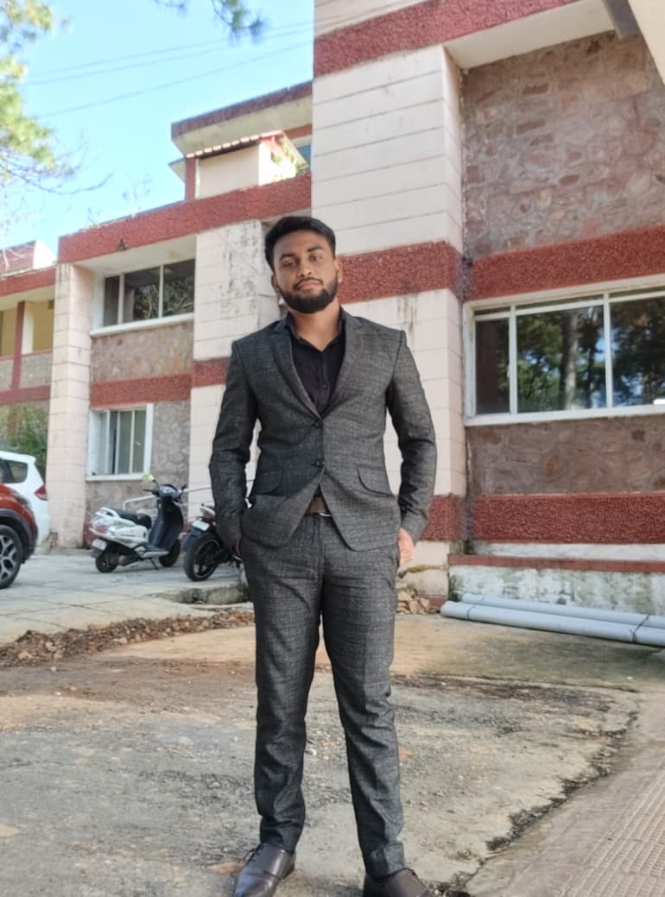

:::{.d-flex .flex-wrap .gap-5 .align-items-start style="max-width: 1100px; margin: 3rem auto; padding: 0 2rem; position: relative;"}

[✨ New Project: West Bengal Electoral Map ↗](https://west-bengal-electoral-map.vercel.app){style="position: absolute; top: 0; right: 2rem; font-size: 12px; font-weight: 600; color: #2d6a4f; background: #e6f4ea; padding: 7px 14px; border-radius: 20px; text-decoration: none; border: 1px solid #a8d5ba; animation: sagePulse 2s infinite;"}

::: {style="flex: 0 0 280px;"}
{style="width: 280px; height: 360px; object-fit: cover; border-radius: 16px; border: 0.5px solid rgba(0,0,0,0.1);"}

::: {style="margin-top: 1rem; background: #f5f5f3; border-radius: 12px; padding: 16px 18px;"}
[LOCATION]{style="font-size: 10px; font-weight: 600; letter-spacing: 0.1em; color: #999; display: block; margin-bottom: 8px;"}
[Duttapukur]{style="font-size: 15px; font-weight: 600; display: block; margin-bottom: 3px;"}
[West Bengal, India]{style="font-size: 13px; color: #666; display: block;"}
:::
:::

::: {style="flex: 1; min-width: 300px; padding-top: 0.5rem;"}
[Geographer & Researcher]{style="font-size: 13px; color: #999; display: block; margin-bottom: 6px;"}
[Suman Bhowmick]{style="font-size: 36px; font-weight: 600; display: block; margin-bottom: 2rem; line-height: 1.2;"}

[INTERESTS]{style="font-size: 10px; font-weight: 600; letter-spacing: 0.1em; color: #999; display: block; margin-bottom: 12px;"}

::: {style="margin-bottom: 2rem; line-height: 2.4;"}
[Hydrology & groundwater]{.tag}
[Watershed modelling]{.tag}
[Sediment transport]{.tag}
[Google Earth Engine]{.tag}
[ML with Python & R]{.tag}
[Geospatial modelling]{.tag}
[Climate-soil interactions]{.tag}
:::

::: {style="border-top: 0.5px solid #e0e0e0; padding-top: 1.5rem;"}
[*"What flows beneath the surface shapes everything above it."*]{style="font-size: 16px; color: #555; font-style: italic; line-height: 1.8;"}
:::
:::
:::

